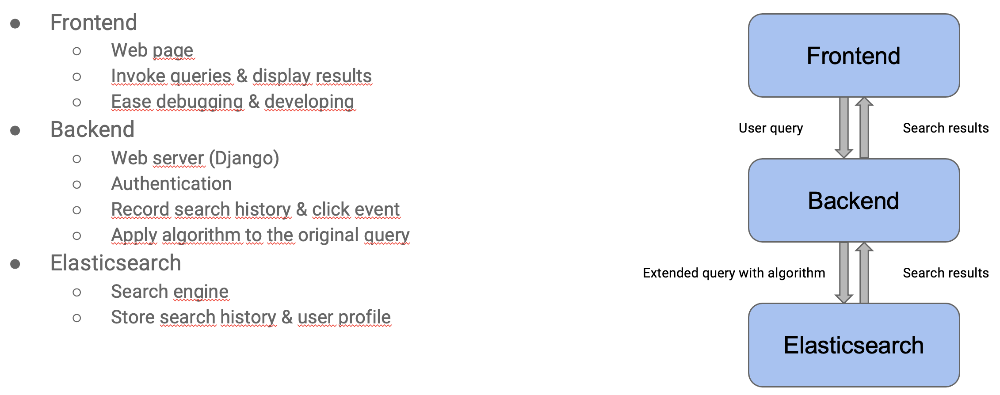
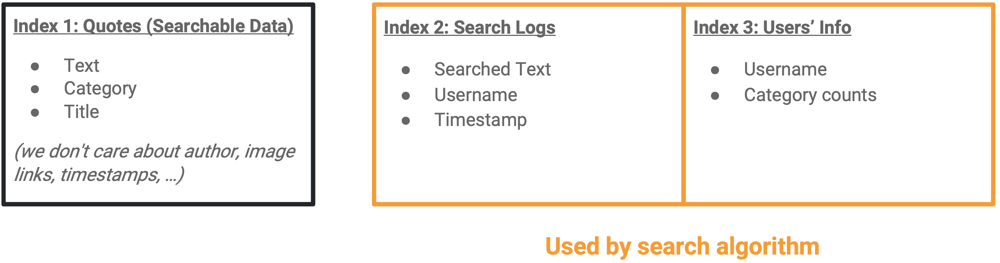

# User Personalized Search Engine with Elasticsearch and Django

## How to Run
#### Setting up ES cluster and Indexing Data

1. Download latest version of docker desktop and set RAM to 5GB (at least 4GB)
2. Start up docker desktop
3. Run: `cd es-setup && ./setup-es.sh`

To shut down ES cluster: `cd es-setup && docker-compose down`
To start up ES cluster again: `cd es-setup && docker-compose up -d`

Typically, we only need to setup ES cluster for one time. Default urls are:

- Kibana: http://localhost:5601
- Frontend (Django): http://localhost:8000

We can then modify code of Django locally.
The local code files are binded to the container.
Saving changes will trigger the hot reload inside the container (but not in the browser).
You can use `docker logs -f personalized-search_django` to view server logs.

To shut down Django service only: `cd es-setup && docker-compose stop django`
To start up Django service again: `cd es-setup && docker-compose up -d django` (You only need this when the server crushes)
 
## Database
- **Search index:** stored into ES and is composed by all the english wikipedia quotes https://en.wikiquote.org/wiki/Main_Page
- **User's info and search logs:** stored also in ES.

## Frontend
For simplicity, this project uses Djangeo and its template engine.
The frontend is just a basic interface to search in the database using the implemented algorithm and a section to login to your user account and view previews searchs and other info.

## Backend
Web server on django framework that handles authentication and applies algorithm to search queries
